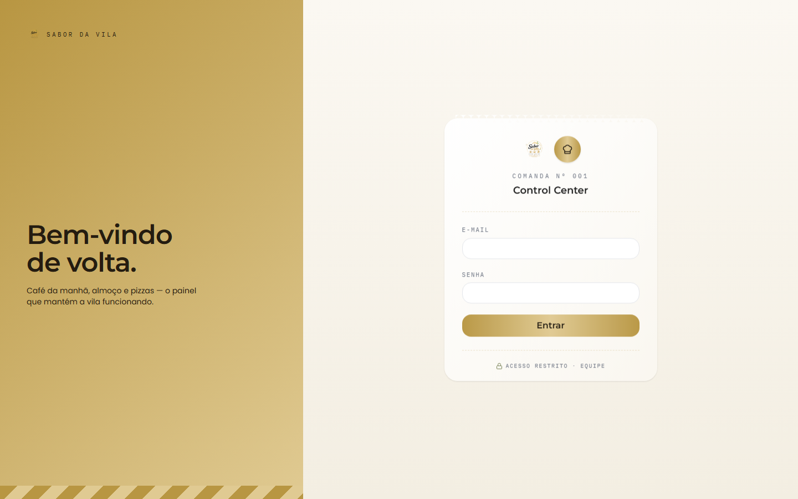
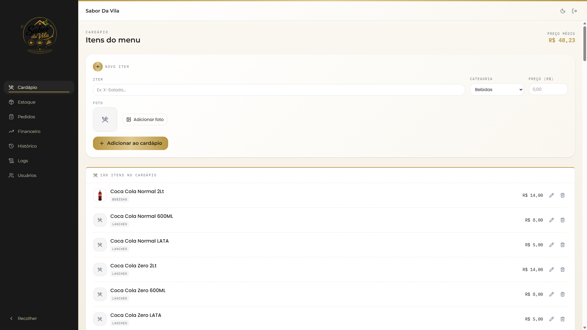
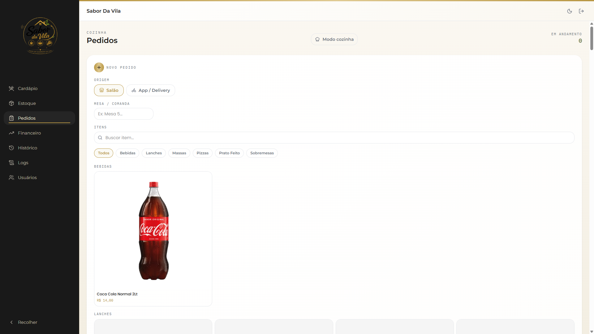
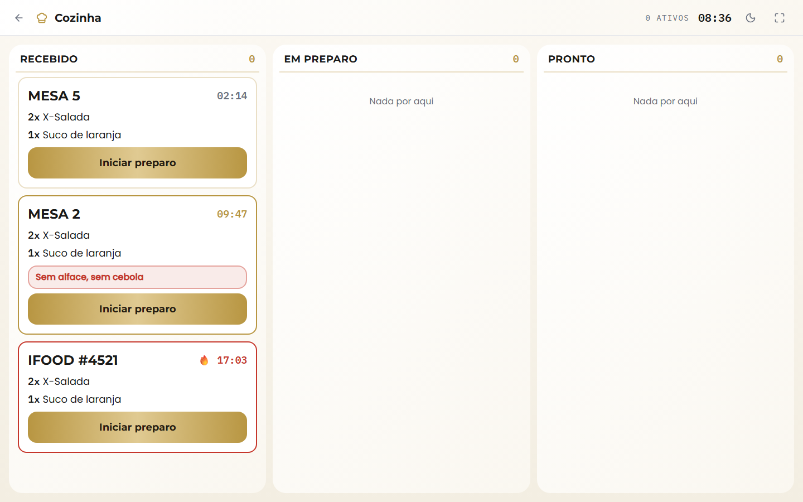
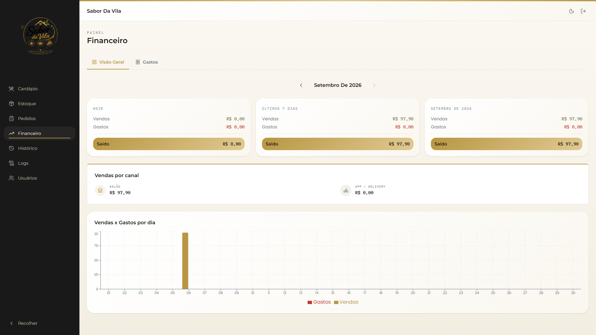

# Sabor Da Vila — Painel de Gestão

Painel administrativo para um restaurante (café da manhã, almoço e pizzas): cardápio, estoque, pedidos com acompanhamento em tempo real, financeiro e uma tela de exibição para a cozinha. Feito em React + TypeScript + Firebase.



## Funcionalidades

### Cardápio e Estoque
Cadastro, edição e remoção de itens do cardápio (por categoria) e controle de estoque com custo de reposição.



### Pedidos
Quadro em tempo real com as colunas Recebido → Em preparo → Pronto → Entregue. Cada pedido pode vir do salão (mesa/comanda) ou de um app de delivery (iFood, 99Food, etc. — identificado por um código livre), e aceita observações como restrições ou trocas ("sem alface, sem cebola"), destacadas no card.



### Modo Cozinha
Tela separada (`/cozinha`), sem menu, pensada pra rodar em tela cheia num monitor da cozinha. Cards grandes, cronômetro ao vivo por pedido e destaque progressivo (dourado → vermelho, com aviso pulsante) para pedidos parados há muito tempo.



### Financeiro
Resumo de vendas e gastos (hoje, últimos 7 dias, mês atual), quebra de receita por canal (salão vs. delivery) e gráfico comparativo. Toda venda é gerada automaticamente quando um pedido chega em "Entregue".



### Histórico e Logs
- **Histórico**: consulta de vendas por dia, com filtro por canal e busca por mesa/item.
- **Logs**: auditoria de tudo que é criado, editado ou removido no sistema (pedido, cardápio, estoque, gasto), com data, ação e usuário responsável.

## Stack

- [React 19](https://react.dev/) + [TypeScript](https://www.typescriptlang.org/)
- [Vite](https://vite.dev/)
- [Tailwind CSS v4](https://tailwindcss.com/)
- [Firebase](https://firebase.google.com/) (Auth + Firestore, com cache local persistente)
- [React Router](https://reactrouter.com/)
- [Recharts](https://recharts.org/) para os gráficos
- [Lucide](https://lucide.dev/) para os ícones

## Rodando localmente

```bash
npm install
npm run dev
```

Outros scripts disponíveis:

```bash
npm run build     # build de produção
npm run lint      # eslint
npm run preview   # preview do build
```

O app já vem apontado para um projeto Firebase (`src/firebase.ts`). Pra usar outro projeto, troque o `firebaseConfig` nesse arquivo pelas credenciais do seu — esses valores não são segredos (a segurança fica nas regras do Firestore), mas cada instalação normalmente aponta pro seu próprio projeto.


## Estrutura do projeto

```
src/
  components/   Layout (sidebar/header) e proteção de rota
  context/      Contexto de autenticação
  hooks/        Um hook por domínio (usePedidos, useCardapio, useFinanceiro, ...)
  pages/        Uma página por rota
  services/     Acesso ao Firestore (um arquivo por coleção)
  types/        Tipos e constantes de cada domínio
  utils/        Formatação de data/moeda
```
